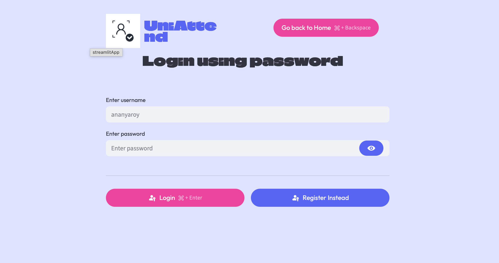
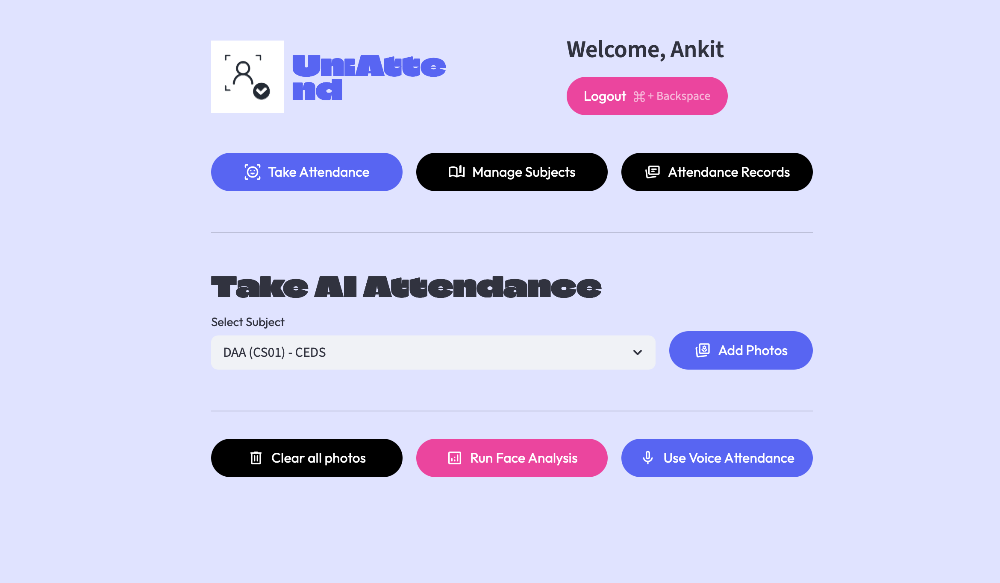
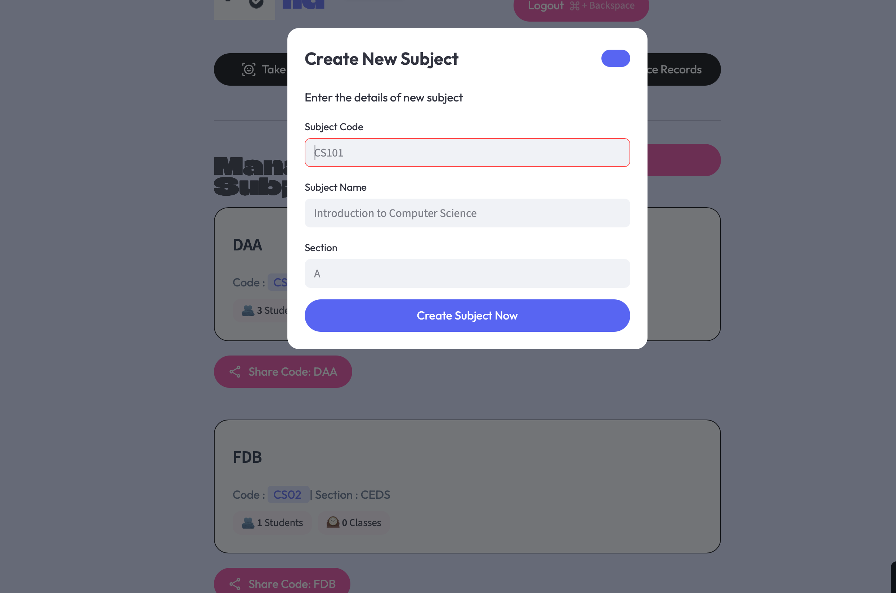
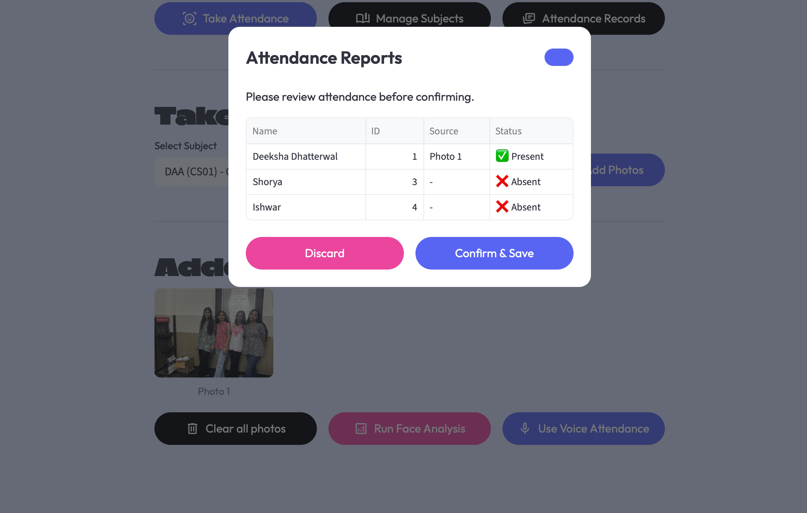

#  UniAttend — AI Powered Attendance System

<p align="center">
  
</p>

<p align="center">
  <b>AI Powered Smart Attendance Platform using Face Recognition, Voice Biometrics & QR Enrollment</b>
</p>

---

#  Overview

UniAttend is an advanced AI-based attendance management system designed to modernize classroom attendance using Computer Vision and Audio Intelligence.

The platform combines:

- 🎭 Face Recognition
- 🎙️ Voice Biometrics
- 📱 QR-Based Enrollment
- ☁️ Cloud-Based Attendance Storage

to create a seamless, automated, and secure attendance ecosystem for educational institutions.

The system eliminates manual attendance processes, reduces proxy attendance, and provides a modern real-time attendance workflow for both teachers and students.

---

#  Problem Statement

Traditional attendance systems are:

- Time-consuming
- Vulnerable to proxy attendance
- Difficult to manage in large classrooms
- Dependent on manual record keeping

Educational institutions require a smart and scalable attendance solution that can automate attendance tracking while maintaining accuracy and security.

---

# 💡 Proposed Solution

UniAttend solves this problem using Artificial Intelligence and biometric verification.

The platform allows:

✅ Teachers to take attendance using classroom images

✅ Students to verify attendance using Voice ID

✅ QR-based instant classroom enrollment

✅ Real-time attendance storage and management

---

# ✨ Core Features

## 🎭 AI Face Analysis

Advanced facial recognition pipeline capable of identifying multiple students from a classroom image using facial embeddings and machine learning classification.

## 🎙️ Sequential Voice ID

Students verify attendance by speaking one-by-one while the system matches their voice embeddings in real-time.

## 📱 QR-Based Enrollment

Teachers generate unique QR/course codes for instant student enrollment.

## 📊 Interactive Dashboards

Separate dashboards for teachers and students to manage attendance and course data.

## ☁️ Cloud Sync

Attendance records are securely stored and synchronized using Supabase cloud infrastructure.

---


# Artificial Intelligence Workflow

The AI engine follows a multi-stage biometric recognition pipeline:

1. Face Detection
   - Detects human faces using dlib's frontal face detector.

2. Facial Landmark Extraction
   - Identifies key facial landmarks such as eyes, nose, and jawline.

3. Face Embedding Generation
   - Converts each detected face into a 128-dimensional numerical embedding.

4. Face Classification
   - A trained Support Vector Machine (SVM) classifier identifies students based on embeddings.

5. Voice Embedding Verification
   - Voice samples are processed using Resemblyzer and Librosa to generate unique voice embeddings.

6. Attendance Confirmation
   - Recognized students are marked present and stored in the attendance database.
  

# ⚙️ Technology Stack

## Frontend
- Streamlit
- HTML
- CSS

## Backend
- Python
- Flask

## Artificial Intelligence
- dlib
- face_recognition_models
- Scikit-learn
- Resemblyzer
- Librosa
- OpenCV

## Database & Cloud
-  Supabase

# 🖥️ Application Preview

---

## 🚀 Landing Page

<p align="center">
  
</p>

---

# ✨ Features Section

<p align="center">
  
  
</p>

---

# 👨‍🏫 Teacher Workflow

## 🔐 Teacher Login

<p align="center">
  
</p>

---

## 📊 Teacher Dashboard

<p align="center">
  
</p>

---

## 📚 Course Management

<p align="center">
  
</p>

---

## 📱 QR / Course Enrollment

<p align="center">
  
</p>

---

## 🎭 FaceID Attendance

<p align="center">
  
</p>

---

## 🎙️ VoiceID Attendance

<p align="center">
  
</p>

---

# 👨‍🎓 Student Workflow

## 📸 Student Face Registration

<p align="center">
  
</p>

---

## 📱 Subject Enrollment

<p align="center">
  
</p>

---

## 📊 Student Dashboard

<p align="center">
  
</p>

---


# ⚙️ Installation

## 1️⃣ Clone Repository

```bash
git clone https://github.com/your-username/Uni-Attend.git
```

---

## 2️⃣ Navigate to Project

```bash
cd Uni-Attend
```

---

## 3️⃣ Create Virtual Environment

### Windows

```bash
python -m venv venv
venv\Scripts\activate
```

### Mac/Linux

```bash
python3 -m venv venv
source venv/bin/activate
```

---

## 4️⃣ Install Dependencies

```bash
pip install -r requirements.txt
```

---

# ▶️ Run Application

```bash
streamlit run app.py
```

---

# 🎯 Future Improvements

- Multi-camera attendance tracking
- Anti-spoofing detection
- Deep learning face recognition
- Mobile application support
- Real-time analytics dashboard
- Cloud deployment at university scale

---
# 👨‍💻 Author

Developed by Deeksha Dhatterwal

---

# ⭐ Support

If you like this project, give it a ⭐ on GitHub.
